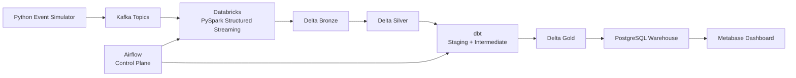

# Real-Time E-commerce Analytics Lakehouse

[Open the live recruiter demo](https://ecommerce-lakehouse-demo.onrender.com)

The interactive recruiter demo is deployed as a free Render web service backed by
Supabase PostgreSQL. Its generated events resume whenever Render wakes the application,
and historical data survives service sleep and redeployment.

An end-to-end streaming analytics reference platform built around Kafka, Databricks,
Delta Lake, Airflow, dbt, PostgreSQL, and Metabase. It produces related customer and
commerce events, preserves replayable raw data in Bronze, validates it in Silver,
builds Delta Gold with dbt, publishes Gold to PostgreSQL, and provisions four business
dashboards.

## Architecture



This is the single production architecture. PySpark Structured Streaming owns Bronze
and Silver, dbt owns staging/intermediate transformations and Delta Gold, PostgreSQL is
the serving warehouse, and Metabase reads only from PostgreSQL. Airflow coordinates
Databricks and dbt without becoming a data path.

See [Architecture](docs/architecture.md) for the layer-by-layer design and delivery
semantics.

## What is included

- Stateful, seeded event simulation for 10 event types, 2,000 customers, and 400 products
- Five partitioned Kafka topics on a single-node KRaft broker
- Idempotent local compatibility sink with manual Kafka offset commits after database commits
- Five Databricks notebooks for Kafka ingestion, Bronze, Silver, Gold publication, and quality checks
- Databricks Asset Bundle configuration for repeatable workspace deployment
- Airflow DAG with availability checks, retries, Databricks hooks, dbt execution,
  warehouse audit logging, and Metabase schema refresh
- dbt-on-Databricks staging, intermediate metrics, eight Delta Gold facts/dimensions, tests, docs, and an
  SCD-style customer snapshot
- Idempotent Metabase bootstrap and 17 saved questions across Executive, Customer,
  Product, and Operations dashboards
- Unit tests, linting, Compose validation, and GitHub Actions CI

## Quick start

Requirements: Docker Desktop with Compose v2 and at least 8 GB available memory.

The Compose stack is a local compatibility harness. It exercises the same contracts,
dbt models, PostgreSQL serving schema, and dashboards without pretending to replace
the canonical Databricks Bronze/Silver path.

```powershell
Copy-Item .env.example .env
docker compose --profile orchestration up -d --build
docker compose exec airflow-scheduler airflow dags trigger ecommerce_pipeline_dag
```

Allow the simulator to produce events for a minute, then trigger the DAG again if the
first run started before data arrived. Check the stack with:

```powershell
docker compose ps
docker compose logs --tail 50 generator event-sink airflow-scheduler
```

Local interfaces:

| Service | URL / endpoint | Default credentials |
|---|---|---|
| Airflow | http://localhost:8080 | `admin` / `admin` |
| Metabase | http://localhost:3000 | `admin@example.com` / `metabase123!` |
| PostgreSQL | `localhost:5432/warehouse` | `ecommerce` / `ecommerce` |
| Kafka | `localhost:9092` | plaintext local listener |

Defaults are development-only. Change every password and secret before sharing a
deployment. The Metabase bootstrap creates the warehouse connection and dashboards
automatically.

To run only the lighter ingestion stack, omit the Airflow profile:

```powershell
docker compose up -d --build
```

## Recruiter cloud demo

The budget deployment deliberately keeps the canonical architecture above as the
production design while running a compact compatibility path for live demonstrations:

- Render hosts the Next.js dashboard and a resumable synthetic event producer in one
  free web process.
- Supabase PostgreSQL stores event history outside Render's ephemeral filesystem.
- A database lease prevents duplicate producers during rolling deployments.
- The application seeds historical events only when the table is empty, then appends
  one new event every three seconds while awake.
- `render.yaml` is the deployment blueprint; `DATABASE_URL` remains a Render secret.

This path demonstrates cold-start recovery and durable analytics within the $5 monthly
ceiling. Kafka, Databricks, Delta, Airflow, dbt, and Metabase remain implemented and
documented as the full platform, but they are not kept running on free-tier hosting.

## Verify data and models

Inspect event volume:

```powershell
docker compose exec postgres psql -U ecommerce -d warehouse -c `
  "select event_type, count(*) from raw.events group by 1 order by 2 desc;"
```

Run dbt against the local PostgreSQL compatibility target:

```powershell
docker compose exec airflow-scheduler dbt source freshness --project-dir /opt/airflow/dbt --profiles-dir /opt/airflow/dbt
docker compose exec airflow-scheduler dbt build --project-dir /opt/airflow/dbt --profiles-dir /opt/airflow/dbt
```

Run repository tests locally:

```powershell
python -m venv .venv
.\.venv\Scripts\python -m pip install -e ".[dev]"
.\.venv\Scripts\python -m pytest
.\.venv\Scripts\python -m ruff check .
```

## Databricks deployment

The notebooks default to continuous `processingTime` triggers. The bundle uses
`available_now` to drain Kafka, Bronze, and Silver before dbt builds Delta Gold. It then
runs Gold-aware quality checks and publishes the eight Gold tables to PostgreSQL.

```powershell
$env:DATABRICKS_HOST = "https://<workspace>"
$env:DATABRICKS_TOKEN = "<token>"
databricks bundle validate -t dev `
  --var="kafka_bootstrap_servers=<broker>:9093" `
  --var="postgres_jdbc_url=jdbc:postgresql://<host>:5432/warehouse"
databricks bundle deploy -t dev `
  --var="kafka_bootstrap_servers=<broker>:9093" `
  --var="postgres_jdbc_url=jdbc:postgresql://<host>:5432/warehouse"
databricks bundle summary -t dev `
  --var="kafka_bootstrap_servers=<broker>:9093" `
  --var="postgres_jdbc_url=jdbc:postgresql://<host>:5432/warehouse"
```

Use a Databricks secret scope for Kafka SASL configuration; never place broker
credentials in a notebook or bundle variable committed to source control. Store the
PostgreSQL user/password as `warehouse-user` and `warehouse-password` in the configured
Databricks secret scope. Copy the four deployed job IDs from the bundle summary into
the corresponding `DATABRICKS_*_JOB_ID` variables. Set `DBT_TARGET=databricks` and the
Databricks SQL `DATABRICKS_HTTP_PATH` for production Airflow runs.

## Repository map

```text
generator/              event contracts, behavior model, and Kafka producer
kafka/topics/           repeatable topic creation
databricks/notebooks/   Bronze/Silver streaming, quality, and Gold publication
databricks/resources/   Databricks Asset Bundle job
airflow/dags/           orchestration DAG
dbt/                    SQL models, tests, documentation, and snapshot
warehouse/              PostgreSQL bootstrap and local-only compatibility sink
dashboards/             Metabase provisioner, manifest, and native SQL
docs/                   architecture, contract, runbook, and cloud migration
tests/                  fast producer/sink unit tests
```

## Operational notes

- Raw events are immutable. Reprocessing uses a new consumer group/checkpoint rather
  than mutating Bronze.
- Silver deduplicates on `event_id` with a one-day watermark; the Gold publisher uses
  atomic table replacement at the PostgreSQL serving boundary.
- Invalid records go to `silver.quarantined_events` with a reason instead of being lost.
- Five-minute Silver freshness is critical in Databricks; dbt warns at five minutes and
  errors at fifteen before Delta Gold is published.
- Local Kafka is intentionally single-node and plaintext. It demonstrates behavior,
  not production availability or security.

See the [runbook](docs/runbook.md) for replay, lag, freshness, and recovery procedures,
and [cloud migration](docs/cloud-migration.md) for AWS and Azure target mappings.

## Resume description

> Built an end-to-end streaming analytics platform using Apache Kafka, Databricks,
> PySpark Structured Streaming, Delta Lake, Airflow, and dbt. Designed a
> Bronze/Silver/Gold lakehouse architecture, automated real-time ETL workflows,
> implemented data quality validation, and developed analytics dashboards for revenue,
> customer behavior, and inventory insights.
