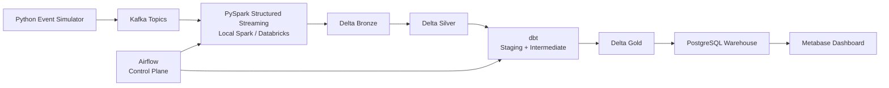

# Real-Time E-commerce Analytics Lakehouse

[Open the live recruiter demo](https://ecommerce-lakehouse-demo.onrender.com)

The interactive recruiter demo is deployed as a free Render web service backed by
Supabase PostgreSQL. Its generated events resume whenever Render wakes the application,
and historical data survives service sleep and redeployment.

An end-to-end streaming analytics platform with two explicit environments: a
reproducible local lakehouse and a deliberately small public recruiter demo. The local
stack runs Kafka, PySpark, Delta Lake, dbt, Airflow, PostgreSQL, and Metabase.
Databricks notebooks and Asset Bundle jobs provide the managed-cloud execution option.
The public Render/Supabase surface demonstrates the product without pretending the
full platform runs continuously on a free tier.

## Architecture


```mermaid
flowchart LR
    G["Python Event Simulator"]
    K["Kafka Topics"]
    DBX["PySpark Structured Streaming\nLocal Spark / Databricks"]
    B["Delta Bronze"]
    S["Delta Silver"]
    DBT["dbt\nStaging + Intermediate"]
    DG["Delta Gold"]
    PG["PostgreSQL Warehouse"]
    M["Metabase Dashboard"]
    A["Airflow\nControl Plane"]

    G --> K
    K --> DBX
    DBX --> B
    B --> S
    S --> DBT
    DBT --> DG
    DG --> PG
    PG --> M

    A --> DBX
    A --> DBT
```

This is the full lakehouse architecture. Local Compose supplies open-source Spark;
Databricks supplies the managed alternative. PySpark owns Bronze and Silver, dbt owns
staging/intermediate transformations and Delta Gold, PostgreSQL is the serving
warehouse, and Airflow coordinates compute and dbt without carrying business data.

See [Architecture](docs/architecture.md) for the layer-by-layer design and delivery
semantics.

## What is included

- Stateful, seeded event simulation for 10 event types, 2,000 customers, and 400 products
- Five partitioned Kafka topics on a single-node KRaft broker
- Local Spark 3.5 and Delta 3.3 execution with build-time-pinned Kafka and PostgreSQL drivers
- Five Databricks notebooks for Kafka ingestion, Bronze, Silver, Gold publication, and quality checks
- Databricks Asset Bundle configuration for repeatable workspace deployment
- Airflow DAG with local Spark or Databricks dispatch, retries, dbt execution,
  warehouse audit logging, and Metabase schema refresh
- dbt-on-Spark/Databricks staging, intermediate metrics, eight keyed Delta Gold facts/dimensions, tests, docs, and an
  SCD-style customer snapshot
- Idempotent Metabase bootstrap and 17 saved questions across Executive, Customer,
  Product, and Operations dashboards
- Unit tests, linting, Compose validation, and GitHub Actions CI

## Quick start

Requirements: Docker Desktop with Compose v2 and at least 8 GB available memory.

The default Compose stack starts the data plane. The orchestration profile adds
Airflow, Metabase, and automatic dashboard provisioning.

```powershell
Copy-Item .env.example .env
docker compose --profile orchestration up -d --build
docker compose exec airflow-scheduler airflow dags trigger ecommerce_pipeline_dag
```

The first DAG run drains the available Kafka backlog, merges Silver and Gold
idempotently, runs dbt tests, publishes eight Gold tables to PostgreSQL, and refreshes
Metabase. Check the stack with:

```powershell
docker compose ps
docker compose logs --tail 50 generator spark-jobs airflow-scheduler
```

Local interfaces:

| Service | URL / endpoint | Default credentials |
|---|---|---|
| Airflow | http://localhost:8080 | `admin` / `admin` |
| Metabase | http://localhost:3000 | `admin@example.com` / `metabase123!` |
| PostgreSQL | `localhost:5432/warehouse` | `ecommerce` / `ecommerce` |
| Kafka | `localhost:9092` | plaintext local listener |

Defaults are development-only. Change every password and secret before sharing a
deployment. The Metabase bootstrap creates the warehouse connection and dashboards
automatically.

To run only Kafka, Spark/Delta, PostgreSQL, and the simulator, omit the profile:

```powershell
docker compose up -d --build
```

## Recruiter cloud demo

The budget deployment deliberately keeps the canonical architecture above as the
production design while running a compact compatibility path for live demonstrations:

- Render hosts the Next.js dashboard and a resumable synthetic event producer in one
  free web process.
- Supabase PostgreSQL stores event history outside Render's ephemeral filesystem.
- A database lease prevents duplicate producers during rolling deployments.
- The application tops up a small historical baseline only when below the configured
  minimum, then appends one event per minute while awake.
- Public-demo history is bounded to 50,000 rows and 35 days. A database-size guard
  stops writes at 200 MB, well before Supabase Free's 500 MB read-only threshold.
- `render.yaml` is the deployment blueprint; `DATABASE_URL` remains a Render secret.

This path demonstrates cold-start recovery and durable analytics within the $5 monthly
ceiling. Kafka, Spark/Databricks, Delta, Airflow, dbt, and Metabase are demonstrated by
the local stack and are intentionally not kept running on free-tier hosting.

## Verify data and models

Inspect event volume:

```powershell
docker compose exec postgres psql -U ecommerce -d warehouse -c `
  "select event_type, count(*) from raw.events group by 1 order by 2 desc;"
```

Run dbt against the local Spark/Delta target:

```powershell
docker compose exec airflow-scheduler dbt source freshness --target local_spark --project-dir /opt/airflow/dbt --profiles-dir /opt/airflow/dbt
docker compose exec airflow-scheduler dbt run --target local_spark --project-dir /opt/airflow/dbt --profiles-dir /opt/airflow/dbt
docker compose exec airflow-scheduler dbt test --target local_spark --project-dir /opt/airflow/dbt --profiles-dir /opt/airflow/dbt
```

Run repository tests locally:

```powershell
python -m venv .venv
.\.venv\Scripts\python -m pip install -e ".[dev]"
.\.venv\Scripts\python -m pytest
.\.venv\Scripts\python -m ruff check .
```

## Databricks deployment

The notebooks default to continuous `processingTime` triggers. The bundle uses
`available_now` to drain Kafka, Bronze, and Silver before dbt builds Delta Gold. It then
runs Gold-aware quality checks and publishes the eight Gold tables to PostgreSQL.

```powershell
$env:DATABRICKS_HOST = "https://<workspace>"
$env:DATABRICKS_TOKEN = "<token>"
databricks bundle validate -t dev `
  --var="kafka_bootstrap_servers=<broker>:9093" `
  --var="postgres_jdbc_url=jdbc:postgresql://<host>:5432/warehouse"
databricks bundle deploy -t dev `
  --var="kafka_bootstrap_servers=<broker>:9093" `
  --var="postgres_jdbc_url=jdbc:postgresql://<host>:5432/warehouse"
databricks bundle summary -t dev `
  --var="kafka_bootstrap_servers=<broker>:9093" `
  --var="postgres_jdbc_url=jdbc:postgresql://<host>:5432/warehouse"
```

Use a Databricks secret scope for Kafka SASL configuration; never place broker
credentials in a notebook or bundle variable committed to source control. Store the
PostgreSQL user/password as `warehouse-user` and `warehouse-password` in the configured
Databricks secret scope. Copy the four deployed job IDs from the bundle summary into
the corresponding `DATABRICKS_*_JOB_ID` variables. Set `DBT_TARGET=databricks` and the
Databricks SQL `DATABRICKS_HTTP_PATH` for production Airflow runs.

## Repository map

```text
generator/              event contracts, behavior model, and Kafka producer
kafka/topics/           repeatable topic creation
spark/                   local Structured Streaming, Delta jobs, and Spark Thrift
databricks/notebooks/   Bronze/Silver streaming, quality, and Gold publication
databricks/resources/   Databricks Asset Bundle job
airflow/dags/           orchestration DAG
dbt/                    SQL models, tests, documentation, and snapshot
warehouse/              PostgreSQL bootstrap and local-only compatibility sink
dashboards/             Metabase provisioner, manifest, and native SQL
docs/                   architecture, contract, runbook, and cloud migration
tests/                  fast producer/sink unit tests
```

## Operational notes

- Raw events are immutable. Reprocessing uses a new consumer group/checkpoint rather
  than mutating Bronze.
- Silver deduplicates on `event_id` with a one-day watermark; the Gold publisher uses
  atomic table replacement at the PostgreSQL serving boundary.
- Invalid records go to `silver.quarantined_events` with a reason instead of being lost.
- Five-minute Silver freshness is critical in Databricks; dbt warns at five minutes and
  errors at fifteen before Delta Gold is published.
- Local Kafka is intentionally single-node and plaintext. It demonstrates behavior,
  not production availability or security.

See [implementation status](docs/implementation-status.md) for the claim-by-claim gap
analysis and honest résumé wording, the [runbook](docs/runbook.md) for recovery, and
[cloud migration](docs/cloud-migration.md) for hosted target mappings.

## Resume description

> Built a reproducible e-commerce lakehouse with Kafka, PySpark Structured Streaming,
> Delta Lake, dbt, Airflow, PostgreSQL, and Metabase, routing 10 event types across five
> topics into replayable Bronze and validated Silver datasets. Developed 17 dbt models
> and 37 quality tests that materialize four fact and four dimension tables in Delta
> Gold, then publish curated data to PostgreSQL for 17 BI questions across four
> dashboards. Packaged equivalent Databricks notebooks and Asset Bundle jobs and
> deployed a cost-capped Render/Supabase recruiter demo.
