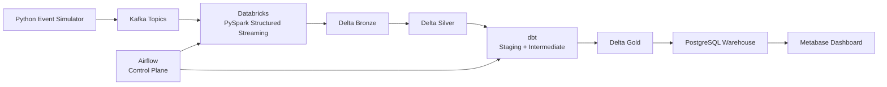

# Architecture and processing guarantees

## Canonical architecture

This is the only production data path. Airflow is a control plane: it starts and
monitors work but does not carry business data.

## Layer ownership

| Stage | Owner | Data contract and responsibility |
|---|---|---|
| Event simulation | Python | Related customer, commerce, refund, product, and inventory events |
| Ingestion | Kafka | Five partitioned topics and durable consumer offsets |
| Processing | Databricks PySpark | Structured Streaming execution, checkpoints, validation, quarantine |
| Bronze | Delta Lake | Original JSON, Kafka coordinates, ingestion time, replayability |
| Silver | Delta Lake | Typed, normalized, deduplicated events and domain tables |
| Analytics engineering | dbt | Silver staging views, intermediate metrics, tests, lineage, documentation |
| Gold | dbt + Delta Lake | Four facts and four dimensions in Unity Catalog `gold` |
| Serving | PostgreSQL | Published copy of Delta Gold for low-latency BI queries |
| BI | Metabase | Saved questions and dashboards over PostgreSQL Gold only |

PySpark does not build Gold tables. dbt is the sole Gold owner. PostgreSQL does not
transform raw events in production; it receives already-curated Delta Gold tables.

## Orchestration sequence

1. Validate Kafka availability.
2. Drain or monitor Kafka ingestion and Bronze processing.
3. Produce validated Silver domain tables.
4. Run dbt staging, intermediate models, Delta Gold models, and dbt tests.
5. Run Gold-aware Databricks quality checks.
6. publish the eight Delta Gold tables to PostgreSQL through JDBC.
7. Audit the serving-warehouse load and refresh Metabase metadata.

The Databricks notebooks offer two trigger modes. `processing_time` is the always-on
streaming mode; `available_now` snapshots starting offsets, drains the bounded backlog,
and terminates so dependent dbt and publication tasks can run.

## Processing guarantees

Structured Streaming checkpoints are separate for every query. A one-day event-time
watermark bounds Silver deduplication state. Delta commits expose each micro-batch
atomically. A restarted stream resumes from its checkpoint; a controlled replay uses a
new checkpoint and reconciles on `event_id`.

dbt tests the Silver-to-Gold boundary for uniqueness, nullability, relationships,
accepted payment methods, positive order values, refund references, and future
timestamps. PostgreSQL publication replaces each serving table only after its complete
Delta Gold source frame is available.

## Gold model grain

| Model | Grain |
|---|---|
| `fact_orders` | one purchased product line/event |
| `fact_sales` | one purchased product line with refunds |
| `fact_sessions` | one customer session |
| `fact_inventory` | one inventory update |
| `dim_customer` | one observed customer |
| `dim_product` | one observed product |
| `dim_date` | one calendar date in the observed range |
| `dim_country` | one normalized country |

## Local compatibility harness

Docker Compose can run without Databricks credentials. Its `event-sink` stores the event
contract in PostgreSQL and the `dev` dbt target builds the same Gold model interface.
This is a test harness for model and dashboard development, not a second architecture.
Production always follows the canonical diagram above.

## Security boundaries

Production requires TLS/SASL Kafka, private networking, workload identities, Unity
Catalog grants, secret scopes, encrypted object storage, and separate service accounts
for Databricks, Airflow, dbt, PostgreSQL, and BI. The Gold publisher reads PostgreSQL
credentials from a Databricks secret scope. Metabase receives read-only access to the
PostgreSQL `gold` schema and no access to Bronze or Silver payloads.
